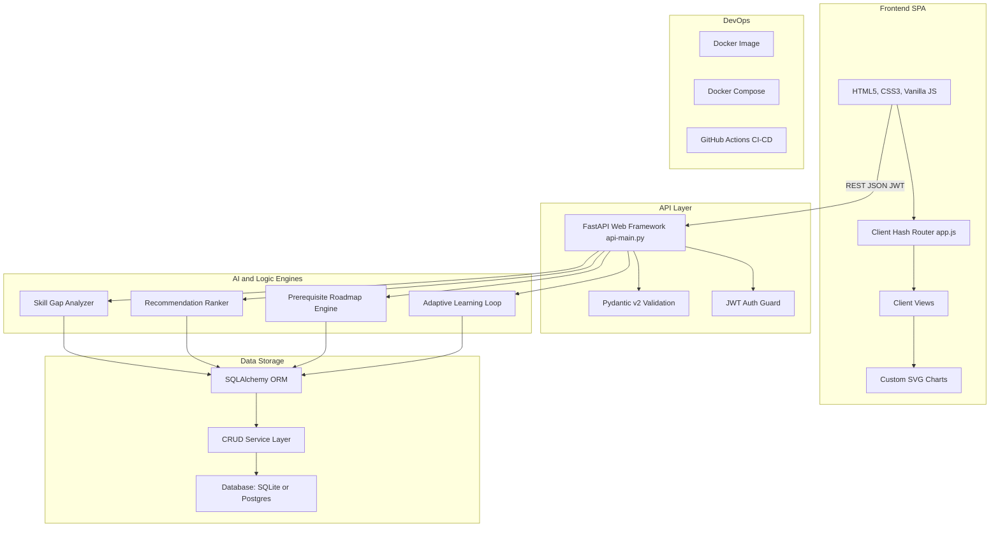
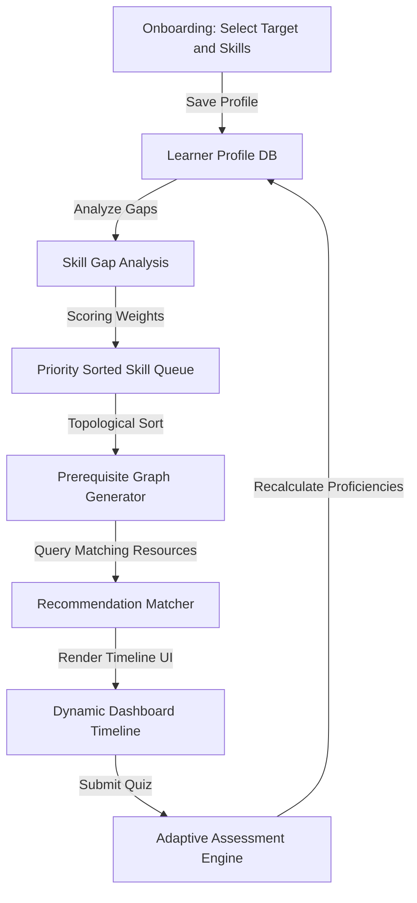

# PathFinder AI — Dynamic Career Roadmap & Adaptive Learning Engine

##### **Created by**: Bhabana Kalita, Shivansh Singh, Aditya Gopal, and Harsh Dixit

---

## The Problem & Our Solution

### The Problem
Traditional online learning is overwhelming. Students facing a career transition are confronted with thousands of courses, but have no clear sense of:
1. **What skills they actually lack** for a specific job profile.
2. **The correct learning sequence** (prerequisites) to build complex skills.
3. **How to measure and adapt** their learning plan when they fail or pass assessments.

### The Solution (PathFinder AI)
PathFinder AI is a closed-loop personalized curriculum agent. It connects a Python FastAPI backend with a zero-dependency HTML5/CSS3/JS single page application to:
* **Quantify Skill Gaps**: Compare current student proficiencies against industry-standard career profiles.
* **Topologically Sort the Curriculum**: Create a strict prerequisite graph (e.g., Python must be learned before ML, which must be learned before RAG).
* **Adapt and Recommend Dynamically**: Recalculate skill proficiencies and re-rank recommendations in real time after quizzes.

---

## System Architecture & Data Pipelines

### 1. High-Level System Architecture



### 2. Adaptive Agent and Learning Pipeline


---

## Technical Stack

*   **Frontend (Single Page Application)**:
    *   **Vanilla JS (ES6+)**: Custom dynamic client router and template renderer. Using vanilla JS keeps the bundle size at near-zero, enabling sub-millisecond page transitions without framework overhead.
    *   **Tailwind CSS & Custom Flex/Grid Styles**: For high-fidelity editorial responsive layout structures.
    *   **Custom SVG Renderer**: Custom drawing routines to render comparison grids and circular progress rings directly in the DOM, eliminating the need for bulky third-party charting libraries.
    *   **Lucide Icons & Web Fonts**: Renders premium typography (`Playfair Display` for editorial headings, `DM Sans` for body, `DM Mono` for metadata stats).
*   **Backend (REST APIs)**:
    *   **FastAPI (Python 3.12)**: A modern, high-performance, asynchronous web framework for building APIs with Python.
    *   **Pydantic v2**: Handles request payload parsing and response serialization with strict type safety.
    *   **SQLAlchemy ORM**: For database modeling and querying.
    *   **PyJWT & Passlib**: Encodes and decodes secure JSON Web Tokens for session handling.
*   **Database & Migrations**:
    *   **SQLite**: Serves as the default local development database (stored in `pathfinder.db`).
    *   **PostgreSQL**: Configured in production and containerized environments.
    *   **Alembic**: Database schema migration controller to manage, version, and apply schema updates.
*   **DevOps & Testing**:
    *   **Docker**: Packages the FastAPI backend and frontend assets inside a unified application image.
    *   **Docker Compose**: Automatically provisions PostgreSQL and mounts the web application.
    *   **Pytest**: Integration and unit testing suite with 47 automated test assertions.
    *   **GitHub Actions**: CI pipeline (`ci.yml`) validating all code changes on every commit.

---

## File Structure

```text
pathfinder_ai/
├── api/                    # FastAPI controllers, schemas, and endpoints
│   ├── routes/             # API Router endpoints
│   │   ├── auth.py         # Registration, JWT login, and profile lookup
│   │   ├── careers.py      # Reference career paths retrieval
│   │   ├── learners.py     # Learner profile onboarding setup
│   │   ├── learning_path.py# Topological learning timeline roadmaps
│   │   ├── progress.py     # Resource completion tracker and quizzes
│   │   ├── recommendations.py# ML scoring matching recommendation engine
│   │   ├── resources.py    # Reference course materials queries
│   │   ├── skill_gap.py    # Quantified skill gap metrics comparisons
│   │   └── skills.py       # Reference skills dictionary
│   ├── schemas/            # Pydantic validation request/response schemas
│   ├── auth.py             # JWT token helpers & security encoders
│   ├── dependencies.py     # Database injection and auth session filters
│   └── main.py             # Core FastAPI application initialization
├── database/               # Database model mapping and seeder
│   ├── connection.py       # SQLAlchemy engine and local/postgres hooks
│   ├── crud.py             # Database create, read, update, delete wrappers
│   ├── models.py           # Declarative tables schemas
│   └── seed.py             # Industry-standard career paths dataset seeder
├── frontend/               # Vanilla HTML5, CSS3, and ES6 SPA
│   ├── index.html          # Clean structure layout
│   ├── styles.css          # Visual theme (Playfair Display & DM Sans)
│   └── app.js              # Client routes, SVGs renderer, and state machine
├── alembic/                # Database migrations revisions
├── tests/                  # Pytest verification suites (47 items)
├── Dockerfile              # Docker container packaging script
├── docker-compose.yml      # Multi-service container launcher
├── requirements.txt        # Backend python dependencies manifest
└── Readme.md               # Hackathon presentation & documentation
```

---

## Installation & Setup

### 1. Prerequisites
* **Python 3.12+**
* **Git**
* (Optional) **Docker & Docker Compose**

### 2. Local Setup
1. **Clone the Repository**:
   ```bash
   git clone https://github.com/bhabana2504/PathFinder.git
   cd PathFinder
   ```

2. **Configure Virtual Environment**:
   ```bash
   python -m venv .venv
   # Windows
   .venv\Scripts\activate
   # macOS/Linux
   source .venv/bin/activate
   ```

3. **Install Dependencies**:
   ```bash
   pip install -r requirements.txt
   ```

4. **Initialize Database Schema & Seeding**:
   ```bash
   # Run alembic migrations
   alembic upgrade head

   # Seed default career paths, skills, and resources
   python -m database.seed
   ```

5. **Start Dev Server**:
   ```bash
   python -m uvicorn api.main:app --reload
   ```
   Open **[http://localhost:8000](http://localhost:8000)** in your browser!

### 3. Docker Launch
To build and spin up the complete application stack including PostgreSQL:
```bash
docker-compose up --build
```
The server will be available on port `8000`.

---

## Testing & Verification

To verify database structures, path generators, recommendation scores, and auth JWT endpoints, execute pytest:
```bash
python -m pytest tests -v
```
**Result**: `47 passed` in under 2 seconds.

---

## Core API Endpoints

| Category | Endpoint | Method | Purpose |
| :--- | :--- | :--- | :--- |
| **Auth** | `/api/auth/register` | `POST` | Registers new learners |
| | `/api/auth/login` | `POST` | Exchanges credentials for Bearer JWT |
| | `/api/auth/me` | `GET` | Gets current active session details |
| **Learner** | `/api/learners/profile`| `GET` | Retrieves profile settings |
| | `/api/learners/profile`| `POST` | Configures target goals and schedule (onboarding) |
| **Careers** | `/api/careers` | `GET` | Retrieves reference career paths list |
| **Skills** | `/api/skills` | `GET` | Retrieves reference skills dictionary |
| **Resources**| `/api/resources` | `GET` | Retrieves reference learning resources list |
| **Skill Gap**| `/api/skill-gap` | `GET` | Computes current vs required gaps & priority scores |
| **Path** | `/api/learning-path` | `GET` | Generates prerequisite-ordered curriculum roadmap |
| **Match** | `/api/recommendations` | `GET` | Returns scored learning resource matching list |
| **Progress**| `/api/progress/complete` | `POST` | Marks resource item as completed |
| | `/api/progress/assessment` | `POST` | Accepts quiz score and dynamically updates skill level |
| | `/api/progress/report` | `GET` | Retrieves profile stats (readiness, strengths, struggles, hours) |
